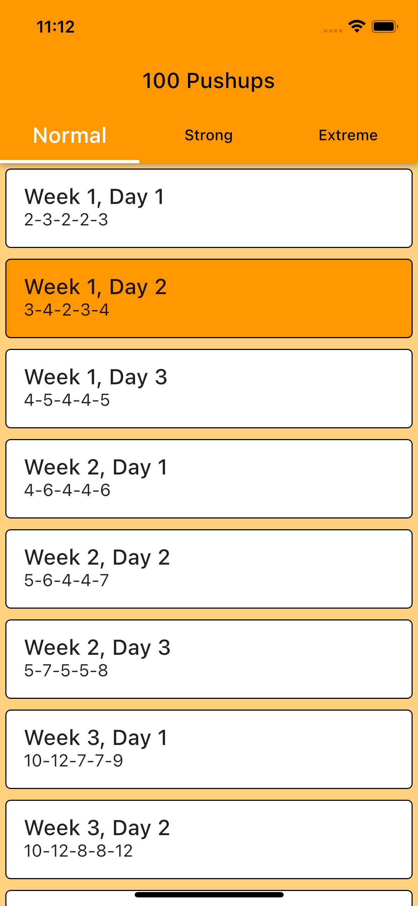
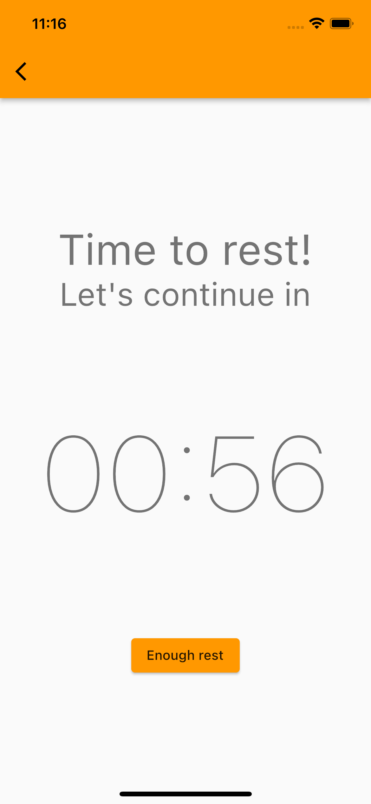

# 100 pushups

The program to train your body to go from 1 pushup to 100 consecutive reps in less than two months

## Getting Started
The workouts are tailored to your starting level. The initial window is called once, but you can change the training program by simply switching to the appropriate tab later.

## Let's train
After starting the program and selecting the current training day (it is highlighted), you must put your device on the floor near your nose and when you do one push-up, touch the screen with your nose. The number on the screen will decrease. When the whole approach is completed, you will have a certain time to rest.

Training List Screen       |  Rest Screen
:-------------------------:|:-------------------------:
  |  

The program supports localization (English, Ukrainian)

